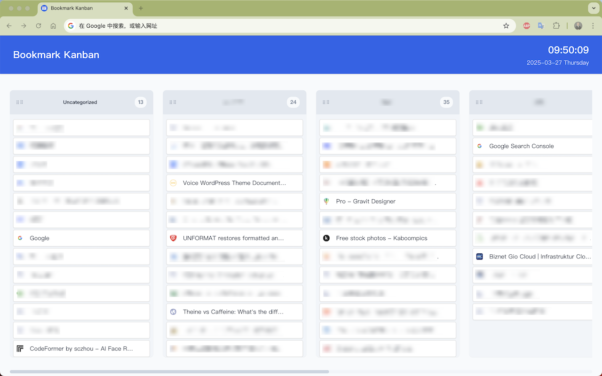

# Bookmark Kanban

A Chrome extension that displays your bookmarks in a visual kanban board layout, making it easier to organize and manage your bookmarks.



## Features

- 📋 Visual kanban board layout for bookmarks
- 🎯 Drag and drop functionality for easy organization
- 📱 Responsive design that works on all screen sizes
- 🔄 Real-time bookmark updates
- 🎨 Clean and modern interface
- 🔍 Quick access to your bookmarks
- 📊 Visual organization of bookmarks by category
- 🕒 Date and time display on the new tab page
- 💾 Layout persistence (columns and bookmarks order is saved)
- 🌐 Website availability checking with visual indicators
- 🖼️ Favicon loading with smart caching

## Installation

1. Clone this repository or download the source code
2. Open Chrome and go to `chrome://extensions/`
3. Enable "Developer mode" in the top right corner
4. Click "Load unpacked" and select the extension directory

## Usage

The extension operates primarily by replacing your new tab page with a kanban board of your bookmarks:

1. Open a new tab to see your bookmarks displayed in a kanban board layout
2. Drag and drop bookmarks between columns to organize them
3. Click on a bookmark to open it in a new tab
4. Use the edit and delete buttons to manage your bookmarks
5. Access settings through the extension popup by clicking the extension icon in your toolbar

## Features in Detail

### Kanban Board Layout
- Bookmarks are organized in columns based on your bookmark folders
- Each column can be reordered by dragging the column header
- Drag and drop bookmarks between columns or within a column
- Visual feedback during drag operations

### Bookmark Management
- Edit bookmark titles and URLs through a modal dialog
- Delete bookmarks with confirmation
- Visual indicators for unavailable websites
- Automatic favicon loading for all bookmarks

### Layout Persistence
- Column order is automatically saved
- Bookmark order within columns is preserved
- Settings are synced through your Chrome account

### User Interface
- Clean and intuitive design
- Responsive layout that adapts to screen size
- Smooth animations and transitions
- Current time and date display

## Development

### Prerequisites
- Chrome browser
- Basic knowledge of HTML, CSS, and JavaScript

### Project Structure
```
bookmark-kanban/
├── js/
│   ├── background.js        # Background service worker
│   ├── popup.js             # Popup window script
│   ├── newtab.js            # New tab page script
│   ├── app.js               # Main application controller
│   └── modules/             # Module directory
│       ├── uiManager.js     # UI rendering and management
│       ├── bookmarkManager.js # Bookmark operations
│       ├── dragManager.js   # Drag and drop functionality
│       ├── storageManager.js # Layout persistence
│       ├── modalManager.js  # Modal dialogs
│       ├── faviconLoader.js # Favicon loading and caching
│       ├── siteChecker.js   # Website availability checking
│       └── utils.js         # Utility functions
├── css/
│   ├── popup.css
│   ├── newtab.css
│   └── modules/             # CSS modules
│       ├── common.css
│       ├── drag.css
│       └── modal.css
├── lib/
│   └── Sortable.min.js      # Third-party drag and drop library
├── icons/
│   ├── icon16.png
│   ├── icon48.png
│   └── icon128.png
├── popup.html
├── newtab.html
└── manifest.json
```

### External Libraries
- Sortable.js - Used for drag and drop functionality (https://github.com/SortableJS/Sortable)

### Building
1. Clone the repository
2. Make your changes
3. Test the extension locally
4. Submit a pull request

## Contributing

Contributions are welcome! Please feel free to submit a Pull Request.

1. Fork the repository
2. Create your feature branch (`git checkout -b feature/AmazingFeature`)
3. Commit your changes (`git commit -m 'Add some AmazingFeature'`)
4. Push to the branch (`git push origin feature/AmazingFeature`)
5. Open a Pull Request

## License

This project is licensed under the MIT License - see the [LICENSE](LICENSE) file for details.

## Privacy

This extension does not collect or transmit any personal data. All data is stored locally in your browser or synced through your Chrome account. See our [Privacy Policy](privacy-policy.html) for more details.

## Support

If you encounter any issues or have suggestions, please:
1. Check the [Issues](https://github.com/chenyifeng/bookmark-kanban-extension/issues) page
2. Create a new issue if needed
3. Provide detailed information about the problem

## Acknowledgments

- Chrome Extensions API
- Sortable.js library
- Modern web technologies
- Open source community

## Author

Chen Yifeng

## Version History


- 0.1.1

  - Update version number in manifest.json
  - Update version display in popup.html
  - Fix modal closing issue with backspace key


- 0.1.0
  - Initial release
  - Visual kanban board for bookmarks
  - Drag and drop functionality
  - Bookmark management features
  - Layout persistence
  - Website availability checking
  - Favicon loading and caching