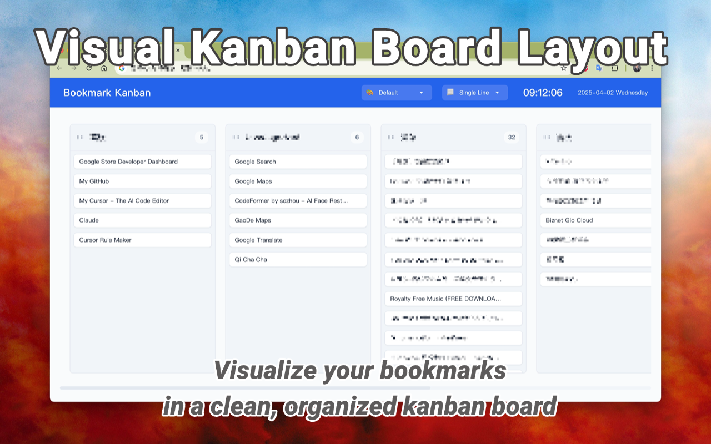
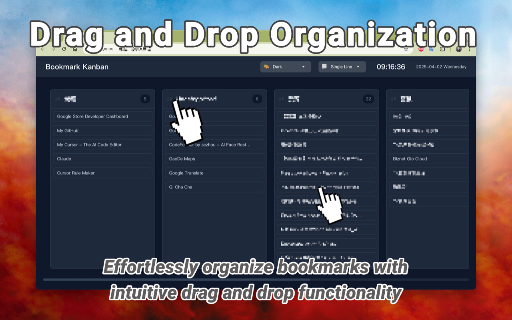
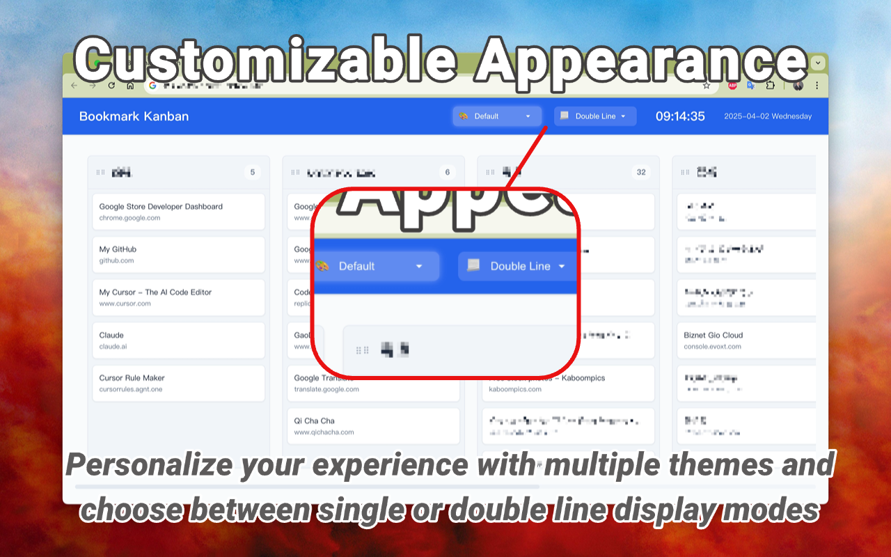
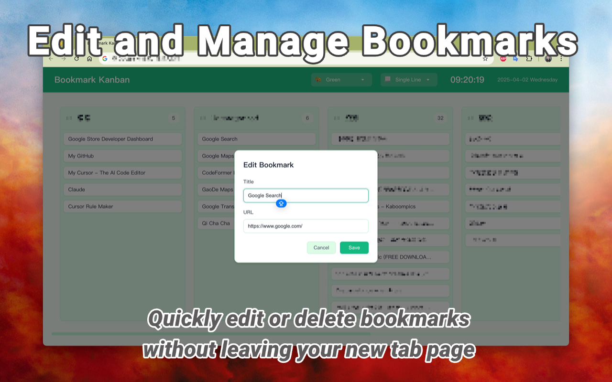
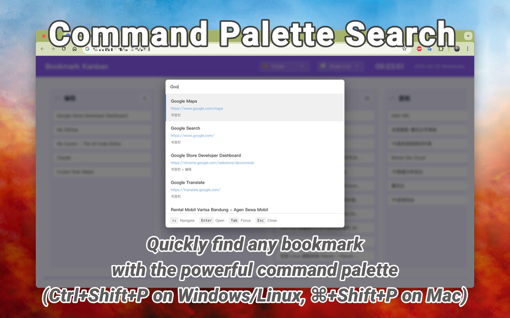

# Bookmark Kanban

A Chrome extension that displays your bookmarks in a visual kanban board layout, making it easier to organize and manage your bookmarks.







## Features

1. **📋 Visual Kanban Board Layout** - Organize bookmarks in a clean, intuitive column-based interface with drag-and-drop functionality

2. **🔍 Powerful Command Palette** - VS Code-style quick search for instantly finding and navigating to any bookmark

3. **🎨 Customizable Appearance** - Multiple themes (Default, Dark, Green, Purple, High Contrast) and display modes (single/double line)

4. **💾 Layout Persistence** - Automatically saves your custom column and bookmark arrangement across sessions

5. **🔄 Real-time Synchronization** - Instant updates when bookmarks are added, edited, or removed in Chrome

## Installation

1. Clone this repository or download the source code
2. Open Chrome and go to `chrome://extensions/`
3. Enable "Developer mode" in the top right corner
4. Click "Load unpacked" and select the extension directory

## Usage

The extension operates primarily by replacing your new tab page with a kanban board of your bookmarks:

1. Open a new tab to see your bookmarks displayed in a kanban board layout
2. Drag and drop bookmarks between columns to organize them
3. Click on a bookmark to open it in a new tab
4. Use the edit and delete buttons to manage your bookmarks
5. Access settings through the extension popup by clicking the extension icon in your toolbar
6. Use the theme selector in the header to switch between different visual themes

## Features in Detail

### Kanban Board Layout
- Bookmarks are organized in columns based on your bookmark folders
- Each column can be reordered by dragging the column header
- Drag and drop bookmarks between columns or within a column
- Visual feedback during drag operations

### Bookmark Management
- Edit bookmark titles and URLs through a modal dialog
- Delete bookmarks with confirmation

### Layout Persistence
- Column order is automatically saved
- Bookmark order within columns is preserved
- Settings are synced through your Chrome account

### Theme System
- Multiple theme options available:
  - Default: Clean and modern light theme
  - Dark: Easy on the eyes dark theme
  - Green: Nature-inspired green theme
  - Purple: Elegant purple theme
  - High Contrast: Accessibility-focused theme
- Theme preference is automatically saved
- System theme detection and auto-switching
- Smooth transitions between themes
- Consistent styling across all components

### User Interface
- Clean and intuitive design
- Responsive layout that adapts to screen size
- Smooth animations and transitions
- Current time and date display

## Development

### Prerequisites
- Chrome browser
- Basic knowledge of HTML, CSS, and JavaScript

### Project Structure
```
bookmark-kanban/
├── js/
│   ├── background.js        # Background service worker
│   ├── popup.js             # Popup window script
│   ├── newtab.js            # New tab page script
│   ├── app.js               # Main application controller
│   └── modules/             # Module directory
│       ├── ui/              # UI components
│       │   ├── UIManager.js # Main UI coordinator
│       │   ├── BookmarkRenderer.js
│       │   ├── ColumnManager.js
│       │   ├── KanbanRenderer.js
│       │   ├── NotificationService.js
│       │   └── UIStateManager.js
│       ├── bookmarkManager.js # Bookmark data management
│       ├── modalManager.js   # Modal dialogs
│       ├── dragManager.js    # Drag and drop functionality
│       └── ...
├── css/
│   ├── popup.css
│   ├── newtab.css
│   ├── themes.css          # Theme definitions
│   └── modules/            # CSS modules
│       ├── common.css
│       ├── drag.css
│       ├── modal.css
│       └── commandPalette.css
├── lib/
│   └── Sortable.min.js     # Third-party drag and drop library
├── icons/
│   ├── icon16.png
│   ├── icon48.png
│   └── icon128.png
├── popup.html
├── newtab.html
└── manifest.json
```

### External Libraries
- Sortable.js - Used for drag and drop functionality (https://github.com/SortableJS/Sortable)

### Building
1. Clone the repository
2. Make your changes
3. Test the extension locally
4. Submit a pull request

## Contributing

Contributions are welcome! Please feel free to submit a Pull Request.

1. Fork the repository
2. Create your feature branch (`git checkout -b feature/AmazingFeature`)
3. Commit your changes (`git commit -m 'Add some AmazingFeature'`)
4. Push to the branch (`git push origin feature/AmazingFeature`)
5. Open a Pull Request

## License

This project is licensed under the MIT License - see the [LICENSE](LICENSE) file for details.

## Privacy

This extension does not collect or transmit any personal data. All data is stored locally in your browser or synced through your Chrome account. See our [Privacy Policy](privacy-policy.html) for more details.

## Support

If you encounter any issues or have suggestions, please:
1. Check the [Issues](https://github.com/chenyifeng/bookmark-kanban-extension/issues) page
2. Create a new issue if needed
3. Provide detailed information about the problem

## Acknowledgments

- Chrome Extensions API
- Sortable.js library
- Modern web technologies
- Open source community

## Author

Chen Yifeng

## Version History

- 1.2.2
  - Refactored application architecture
    - Split app.js into multiple independent modules
    - Added AppCoordinator.js as application coordinator
    - Added EventManager.js for event handling
    - Added MessageHandler.js for message communication
    - Added SiteCheckManager.js for website checking
    - Added NotificationManager.js for notifications
    - Optimized code organization and improved maintainability

- 1.2.1
  - Fixed layout issues
    - Optimized kanban board layout with consistent left margin
    - Removed unnecessary media queries for screen resolution
    - Improved overall layout stability

- 1.2.0
  - Enhanced bookmark availability checking
    - Replaced automatic periodic checks with manual check button
    - Optimized checking algorithm using DNS resolution and favicon checks
    - Added certificate error status display (yellow warning)
    - Implemented parallel checking for improved speed
    - Added progress indicator during checks
    - Used session storage for check results
    - Skipped local network address checks
    - Added 24-hour check cache for better performance

- 1.1.0
  - Added column title editing feature with double-click interaction
  - Added visual feedback for editable and non-editable columns
  - Improved column header interaction with drag handle
  - Enhanced user experience with clear feedback messages

- 1.0.0
  - Added VS Code style command palette for quick bookmark search
  - Enhanced visual feedback for search results across all themes
  - Improved accessibility with high contrast animations
  - Added flexible display modes (single-line and double-line layouts)
  - Simplified interface with clean typography
  - Improved dark theme button styles
  - Unified animation effects across all themes
  - Enhanced overall user experience

- 0.1.2
  - Added theme selection feature with multiple theme options
  - Added system theme detection and auto-switching
  - Improved theme transition animations
  - Added theme persistence

- 0.1.1
  - Update version number in manifest.json
  - Update version display in popup.html
  - Fix modal closing issue with backspace key

- 0.1.0
  - Initial release
  - Visual kanban board for bookmarks
  - Drag and drop functionality
  - Bookmark management features
  - Layout persistence
  - Website availability checking
  - Favicon loading and caching